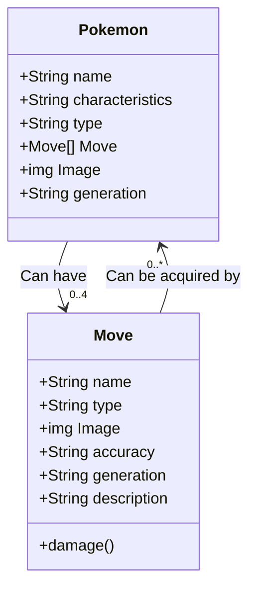

# Project Documentation

Here are our proposed data types:

Relations:

* A **Move** can have any number of **Pokemon** (including 0). Pokemon have a max of four moves, so they will be the ones with a connection to move. There is no ownership.
  A Pokemon can forget a move and if a Pokemon is deleted the moves all still exist.
  * Relationship stored on Pokemon side
  * When a move is deleted, all Pokemon lose that specific move and are updated with the **clear** policy
